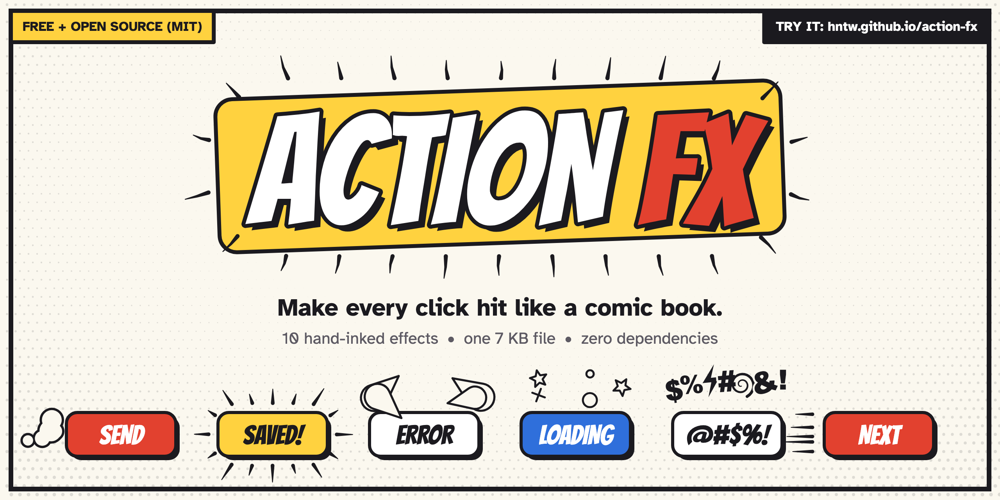

# Action FX

[](https://hntw.github.io/action-fx/)

An archive of comic-strip marks as feedback effects for user actions. One file, no dependencies, MIT,
about 7 KB minified and gzipped. Most names come from Mort Walker's *The Lexicon of Comicana* (1980).

**Live demo:** https://hntw.github.io/action-fx/

| effect | the mark | use it for | options beyond the shared ones |
|---|---|---|---|
| `emanata` | surprise lines | a click or tap | shape (ring, corners, point), count, length, width, gap, travel |
| `plewds` | sweat drops | an error, a nervous moment | count, size |
| `agitrons` | shake lines | wrong password, invalid field | lines, gap |
| `briffits` | dust puffs | send, submit, take off | count, size, from (bottom, left, right) |
| `solrads` | shine rays | success, unlocked, new | count, length, gap, width, sparkles |
| `squeans` | dizzy stars | loading, overload | count, size |
| `spurls` | confusion spiral | not found, nothing here | size, turns, width |
| `waftaroms` | waft lines | hot, fresh, just baked | count, length, rise, width |
| `grawlixes` | cursing symbols | a playful error | count, size, font |
| `speedlines` | motion lines | next, go, move along | count, length, gap, width, dir (right, left, up, down) |

Shared options: scale, speed, color (`auto` = surrounding text color), fill (`auto` = page background),
move (the element reacts), loop, seed, duration, reducedMotion.

```html
<script src="actionfx.js" defer data-bind="button, .btn"></script>
<button data-afx="briffits" data-afx-from="left">Send</button>
```

```js
ActionFX.bind('button', { effect: 'emanata', shape: 'corners' });
const h = ActionFX.play('squeans', el, { loop: true }); h.stop();
ActionFX.agitrons(field);                     // one shortcut per effect; ActionFX.click = emanata
ActionFX.draw(ctx, t, { effect, x, y, w, h }); // pure function of t (seconds), for video frames
```

- `index.html` is the archive/demo page.
- `review/sheet.html` + `review/shot.sh` render a contact sheet (rows = effects, `?fx=a;b:{"opt":1}`).
- `review/mock.mjs` runs every effect through `draw()` in node with odd sizes and modes to catch errors and NaNs.

Made for fun by Jamie Grove and Claude.
